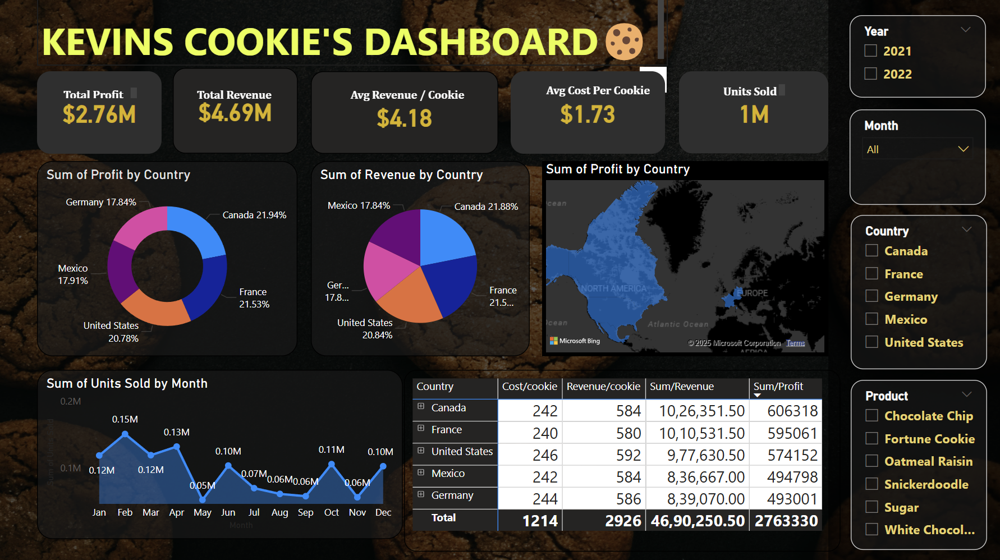

# Kevin's Cookie Dashboard - Power BI Demo

This repository contains a Power BI demo dashboard visualizing sales data for Kevin's Cookies.  This project was created for learning and practicing Power BI functionalities.

## Overview

The dashboard provides insights into Kevin's Cookies' sales performance across different dimensions, including:

* **Overall Performance:** Total Profit, Total Revenue, Average Revenue per Cookie, Average Cost per Cookie, and Units Sold.
* **Geographic Distribution:** Profit and revenue distribution across different countries (Canada, France, Germany, Mexico, United States).
* **Temporal Analysis:** Sales trends over the months of the year.
* **Product Performance:**  Profitability and revenue generated by different cookie types (Chocolate Chip, Fortune Cookie, Oatmeal Raisin, Snickerdoodle, Sugar, White Chocolate...).

## Key Visualizations

The dashboard utilizes a variety of visualizations to represent the data effectively:

* **KPI Cards:** Display key performance indicators like Total Profit and Total Revenue.
* **Pie Charts:** Illustrate the proportion of profit and revenue contributed by each country.
* **Map:**  Visually represent profit distribution across geographical locations.
* **Column Chart:** Show the monthly breakdown of units sold.
* **Table:** Provide detailed information about cost, revenue, and profit for each product in each country.
* **Slicers:** Allow users to filter data by year, month, country, and product.

## Data

The underlying data for this dashboard is mock sales data for Kevin's Cookies.  It includes information on transactions, products, and geographical locations.  *(Note: As this is a demo, the data is not real business data.)*

## How to Use

1. **Download:** Download the Power BI file (`*.pbix`) from this repository.
2. **Open:** Open the file using Microsoft Power BI Desktop.
3. **Interact:** Explore the dashboard, use slicers to filter data, and analyze the different visualizations.

## Purpose

This project was created as a learning exercise to explore and demonstrate Power BI capabilities, including:

* Data import and transformation
* DAX measures and calculations
* Creating interactive visualizations
* Designing a user-friendly dashboard layout